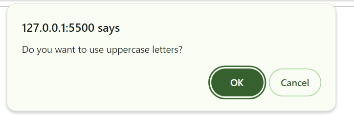

# Password-generator-site
## Description
In this project, i was furthering my knowledge of javascript by using functions instead of long loops or ifs. I also used filtering techniques to be able to select only the values the user selected to create the desired password
### Link to project
 https://angelica-zach.github.io/Password-generator-site/
## Usage 

This is an example of a prompt for options the user recieves which is saved as eiher boolean true/ false

An example of what a user can expect to see
## Instalation
Press the green code button and select your desired option  eg. for ssh copy and use git clone in the terminal 

### Pseudocode
set global variables so can be reused(setting length to 0 and all characters to false)
(do most in alerts and prompts so user can easily interact)
use  a prompt for length of password 
user confirms for each of the possible characters

within generator function {
    if length >= 8 and =<128 then accepted otherwise error
    if (uppercase or lowercase or numerical or special =true )accepted otherwise error
        accepted= generates a random variable from each array .
        each selected array from boolean true
        log on screen
    else false then display error and ask to try again    
## License
MIT License

Copyright (c) [2023] [angelica zachowski]

Permission is hereby granted, free of charge, to any person obtaining a copy of this software and associated documentation files (the "Software"), to deal in the Software without restriction, including without limitation the rights to use, copy, modify, merge, publish, distribute, sublicense, and/or sell copies of the Software, and to permit persons to whom the Software is furnished to do so, subject to the following conditions:

The above copyright notice and this permission notice shall be included in all copies or substantial portions of the Software.

THE SOFTWARE IS PROVIDED "AS IS", WITHOUT WARRANTY OF ANY KIND, EXPRESS OR IMPLIED, INCLUDING BUT NOT LIMITED TO THE WARRANTIES OF MERCHANTABILITY, FITNESS FOR A PARTICULAR PURPOSE AND NONINFRINGEMENT. IN NO EVENT SHALL THE AUTHORS OR COPYRIGHT HOLDERS BE LIABLE FOR ANY CLAIM, DAMAGES OR OTHER LIABILITY, WHETHER IN AN ACTION OF CONTRACT, TORT OR OTHERWISE, ARISING FROM, OUT OF OR IN CONNECTION WITH THE SOFTWARE OR THE USE OR OTHER DEALINGS IN THE SOFTWARE.

}
